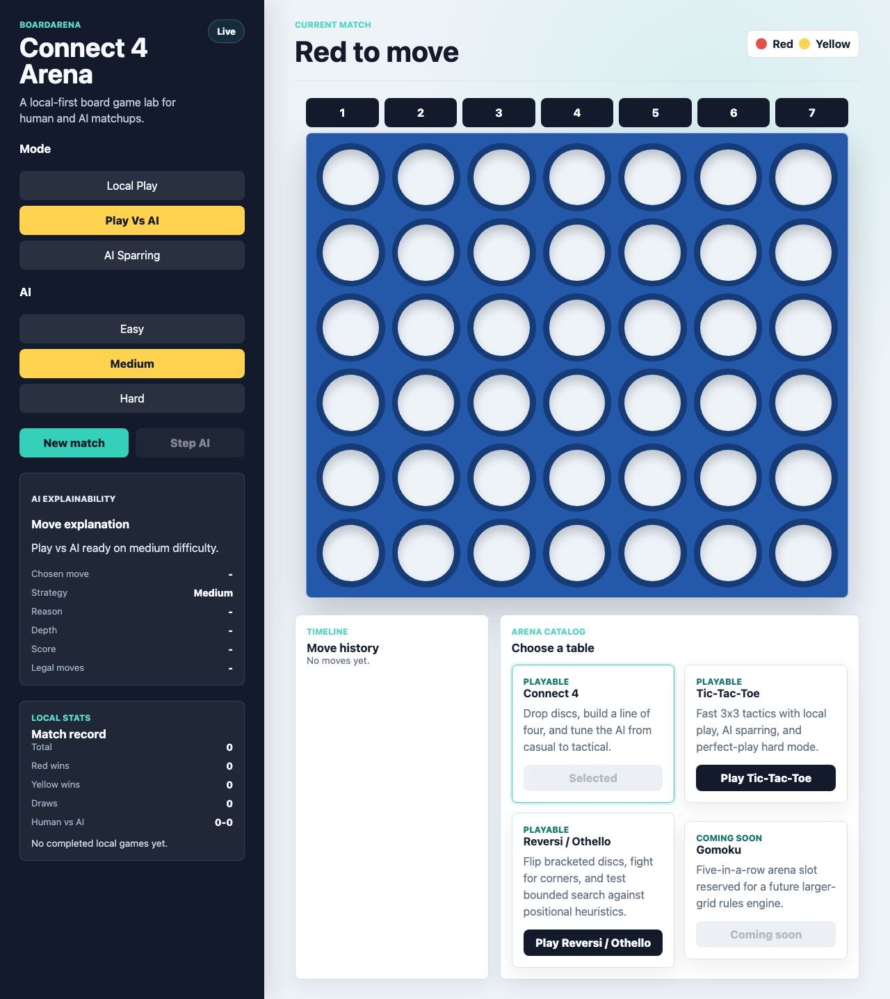
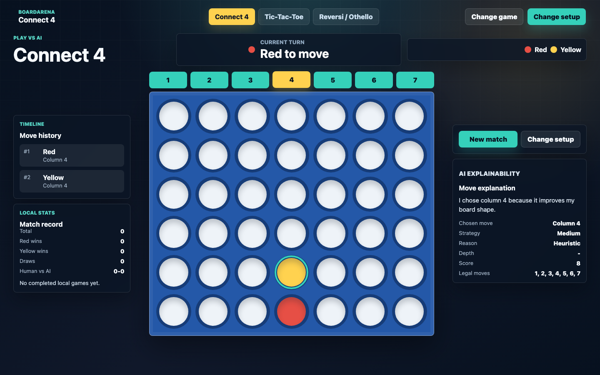
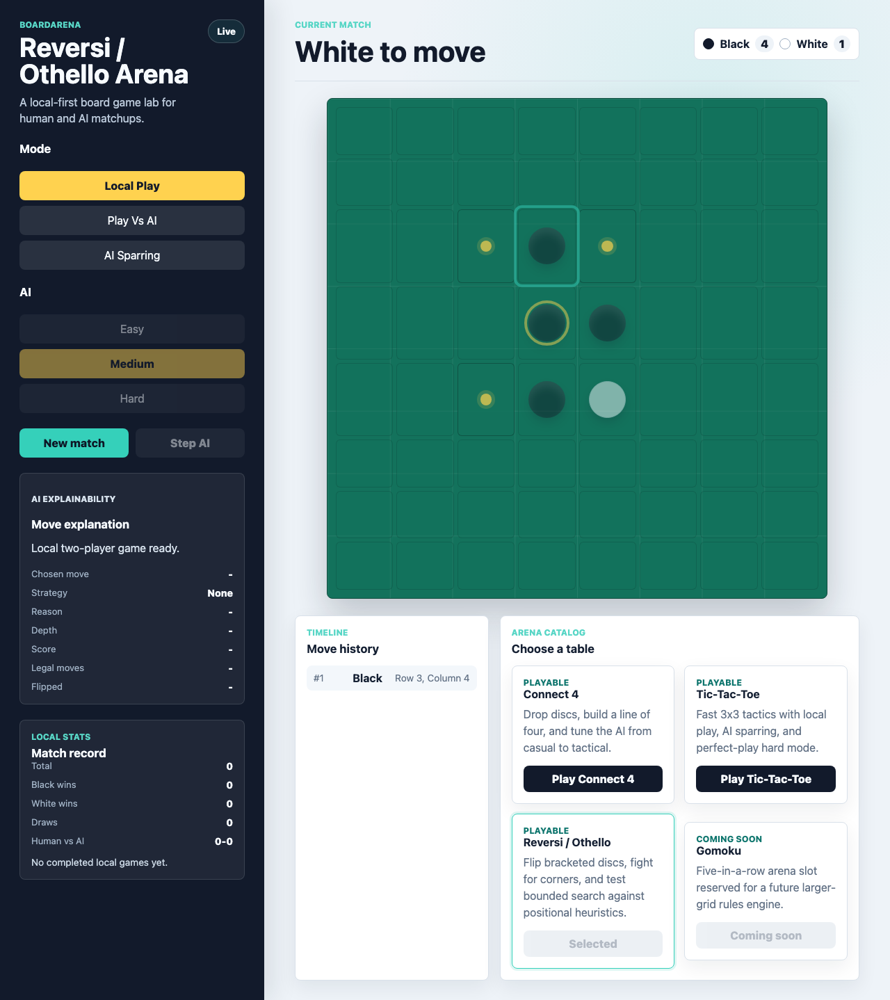

# BoardArena

BoardArena is a local-first AI board-game arena built with React, Vite, TypeScript, and FastAPI. It is designed as a portfolio-ready full-stack app: the frontend delivers a polished multi-game experience, while the backend owns game sessions, legal move validation, state transitions, scoring, and AI move selection.

## Features

- Three playable games with a shared session model: Connect 4, Tic-Tac-Toe, and Reversi / Othello.
- PvP, human-vs-AI, and AI-vs-AI modes.
- Easy, medium, and hard AI strategies per game.
- Move history, current-turn state, legal move indicators, and last-move highlights.
- Winning-cell or flipped-cell highlights where the game rules support them.
- Reversi score display and forced-pass/game-over messaging.
- AI explanation metadata with chosen move, strategy, reason, score/depth when available, and legal moves considered.
- Spectator controls for AI-vs-AI matches.
- Per-game localStorage stats for quick demo sessions.
- Backend-owned rule validation, so illegal moves are rejected by the API.

## Playable Games

- **Connect 4**: drop-column gameplay with win detection, tactical AI, and winning-cell highlights.
- **Tic-Tac-Toe**: compact perfect-information play with full minimax hard mode.
- **Reversi / Othello**: 8x8 disc flipping, legal move hints, pass-turn handling, score-based endings, and positional AI heuristics.
- **Gomoku**: catalog placeholder for a future milestone.

## Screenshots



BoardArena home screen with compact game navigation and contextual match setup.



Connect 4 human-vs-AI match with the board centered and AI explanation visible as a lightweight HUD panel.



Reversi local match with legal move indicators, score, and flipped-disc highlighting in the redesigned game stage.

## Tech Stack

- **Frontend**: React 19, TypeScript, Vite, plain CSS.
- **Backend**: FastAPI, Pydantic, Uvicorn.
- **Game logic**: Python; NumPy for Connect 4, standard Python structures for Tic-Tac-Toe and Reversi.
- **Persistence**: none on the backend. Browser-only match stats use localStorage.

## AI Strategy Overview

- **Easy**: random legal move.
- **Medium**: game-specific tactical heuristics.
  - Connect 4 looks for wins, blocks, and useful board shape.
  - Tic-Tac-Toe prioritizes win/block opportunities and line strength.
  - Reversi prefers corners, avoids risky squares near empty corners when possible, and values flips/position.
- **Hard**: bounded search.
  - Connect 4 uses minimax-style search with alpha-beta pruning.
  - Tic-Tac-Toe searches the full game tree.
  - Reversi uses bounded depth-4 alpha-beta search with corners, edges, mobility, disc differential, and positional weights.

## Local Setup

Optional local environment examples are provided for both app pieces:

```bash
cp backend/.env.example backend/.env
cp frontend/.env.example frontend/.env
```

Install backend dependencies from the repository root:

```bash
python3 -m pip install -r backend/requirements.txt
```

Install frontend dependencies:

```bash
cd frontend
npm install
```

## Run The Backend

From the repository root:

```bash
python3 -m uvicorn backend.app.main:app --host 127.0.0.1 --port 8000 --reload
```

Health check:

```bash
curl -sS http://127.0.0.1:8000/health
curl -sS http://127.0.0.1:8000/api/health
```

## Run The Frontend

From `frontend/`:

```bash
npm run dev -- --port 5173
```

Open:

```text
http://127.0.0.1:5173/
```

The frontend defaults to `http://127.0.0.1:8000` for the API. For a different local or deployed API, set `VITE_API_BASE_URL` when running or building the frontend:

```bash
VITE_API_BASE_URL=https://your-api.example.com npm run build
```

## Validation

Run the full local validation helper from the repository root:

```bash
npm run validate:local
```

The helper runs the backend compile check, backend smoke tests, frontend dependency install, TypeScript typecheck, production build, and local Playwright smoke suite in order.

Backend compile check:

```bash
python3 -m compileall backend
```

Backend smoke tests:

```bash
python3 -m backend.tests
```

Frontend checks:

```bash
cd frontend
npm install
npm run typecheck
npm run build
npm run test:smoke
```

The frontend smoke suite uses Playwright and starts both local servers automatically: FastAPI on `127.0.0.1:8000` and Vite on `127.0.0.1:5173`. If Playwright has not installed its browser binary yet, run this once from `frontend/`:

```bash
npx playwright install chromium
```

Full local validation order:

```bash
python3 -m compileall backend
python3 -m backend.tests
cd frontend
npm install
npm run typecheck
npm run build
npm run test:smoke
```

Whitespace check before committing:

```bash
git diff --check
```

## Technical Highlights

- Shared backend session architecture supports multiple game engines behind one `/games` API surface.
- Rules engines keep validation authoritative on the server instead of trusting the client.
- Game state responses expose the metadata each board needs while preserving a common frontend flow.
- AI move responses include structured explanation metadata for a transparent demo experience.
- The React app shares contextual setup, AI stepping, spectator controls, history, stats, and compact game navigation across games while keeping board rendering game-specific.
- Reversi includes directional scanning, multi-direction flipping, forced-pass handling, and score-based terminal states.

## Deployment

BoardArena deploys as two pieces:

- **Frontend**: a static Vite build from `frontend/`.
- **Backend**: a FastAPI ASGI service from `backend.app.main:app`.

You can host the pieces on any platform that supports static sites plus Python ASGI services. The frontend build must know the deployed API URL, and the backend must allow the deployed frontend origin with CORS. Do not hardcode production URLs into source code; set environment variables in the hosting provider.

Required production configuration:

| Location | Variable | Example | Notes |
| --- | --- | --- | --- |
| Frontend | `VITE_API_BASE_URL` | `https://api.example.com` | Used at Vite build time. Leave unset only when the browser should call the local default `http://127.0.0.1:8000`. |
| Backend | `ALLOWED_ORIGINS` | `https://boardarena.example.com` | Comma-separated exact browser origins allowed by CORS. Local defaults are `http://127.0.0.1:5173,http://localhost:5173`. |
| Backend | `APP_ENV` | `production` | Optional safe environment label returned by health endpoints. |

Health endpoints are available at `/health` and `/api/health`. They return app status, app name, environment, and version without exposing sensitive environment variables.

### Backend Service

Configure the Python service from the repository root or with `backend/` as the app directory, depending on the provider. The ASGI app import path is:

```text
backend.app.main:app
```

Typical install/start commands:

```bash
python3 -m pip install -r backend/requirements.txt
python3 -m uvicorn backend.app.main:app --host 0.0.0.0 --port "$PORT"
```

Set backend environment variables:

```text
ALLOWED_ORIGINS=https://your-frontend.example.com
APP_ENV=production
```

After the backend deploys, verify health:

```bash
curl -sS https://your-api.example.com/health
curl -sS https://your-api.example.com/api/health
```

Both responses should include `"status":"ok"`.

### Frontend Static Site

Configure the static site with `frontend/` as the project directory.

Typical commands:

```bash
npm install
VITE_API_BASE_URL=https://your-api.example.com npm run build
```

Publish the generated directory:

```text
frontend/dist
```

Set the frontend environment variable in the hosting provider before building:

```text
VITE_API_BASE_URL=https://your-api.example.com
```

For a single Vercel project with the included `vercel.json` multi-service config, the frontend is served at `/` and the backend is served at `/_backend`. In that setup, set the frontend build variable to the same-origin route prefix:

```text
VITE_API_BASE_URL=/_backend
```

Keep the backend `ALLOWED_ORIGINS` value set to the exact deployed frontend origin, for example `https://your-app.vercel.app`.

### Production Smoke Checks

After both services are deployed, run the production smoke script from the repository root:

```bash
PUBLIC_FRONTEND_URL=https://your-frontend.example.com PUBLIC_API_BASE_URL=https://your-api.example.com npm run smoke:production
```

The script checks:

- `/health` and `/api/health` return `status: "ok"`.
- The frontend URL returns an HTML page.
- CORS preflight allows the deployed frontend origin.
- Connect 4, Tic-Tac-Toe, and Reversi game creation works.
- One valid human move works for each playable game.

The script prints `PASS`, `FAIL`, and `INFO` lines and exits nonzero on failure. It does not require secrets.

### Deployment Checklist

- Run `python3 -m compileall backend`.
- Run the backend smoke tests from the Validation section.
- Run `npm run typecheck` from `frontend/`.
- Run `npm run build` from `frontend/` with the production `VITE_API_BASE_URL`.
- Run `npm run test:smoke` from `frontend/` for local browser smoke coverage.
- Deploy the backend with `ALLOWED_ORIGINS` set to the deployed frontend origin.
- Deploy the frontend with `VITE_API_BASE_URL` set to the deployed backend origin.
- Confirm the deployed API health endpoints return `status: "ok"`.
- Run `npm run smoke:production` with `PUBLIC_FRONTEND_URL` and `PUBLIC_API_BASE_URL`.
- Open the deployed frontend in a browser and start a match against the deployed API.

### Common Deployment Failures

- **Frontend cannot reach backend**: confirm the backend service is running and `VITE_API_BASE_URL` was set before the frontend build.
- **CORS origin not allowed**: set `ALLOWED_ORIGINS` to the exact frontend origin, such as `https://boardarena.example.com`, without a path.
- **Wrong API base URL**: use the backend origin only, for example `https://api.example.com`, not `https://api.example.com/health` or a frontend URL.
- **Backend service sleeping or cold start**: retry health checks after the service wakes; first API calls may be slower on free or scale-to-zero hosts.
- **In-memory sessions are process-local**: sessions reset on backend restart and are not shared across multiple backend workers or regions.

Do not commit secrets or local environment files. Generated artifacts such as `frontend/dist`, `frontend/node_modules`, Python bytecode, `.DS_Store`, and local env files should remain ignored. Playwright reports, traces, videos, and test result folders should remain ignored unless a specific debugging artifact is intentionally shared outside the repo.

## Current Limitations

- No auth, accounts, database persistence, online multiplayer, or saved match history.
- Backend sessions are in memory and reset when the API restarts.
- Multiple backend workers would not share game state.
- Local match stats are per-browser and can be cleared with site data.
- No LLM API calls are wired into gameplay or explanations.
- Frontend smoke coverage is intentionally lightweight and browser-based; it does not replace exhaustive component or visual regression testing.
- ESLint is not configured yet; the current lightweight frontend quality gate is TypeScript typechecking plus the production build.
- Backend smoke tests are simple Python functions; pytest is not listed as a dependency.
- Reversi hard AI is bounded for local responsiveness and is not a tournament-strength engine.

## Future Roadmap

- Add Gomoku as the fourth playable game.
- Add optional hosted-demo links.
- Consider ESLint or a small unit-test layer once the public demo surface stabilizes.
- Consider persistent match history after the local-first demo is stable.
